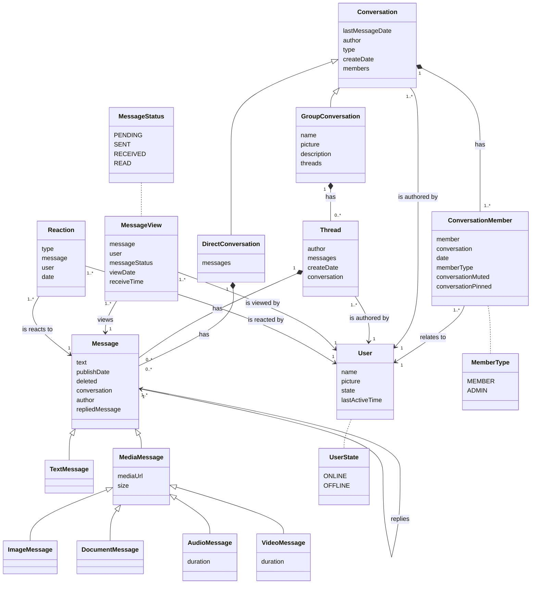
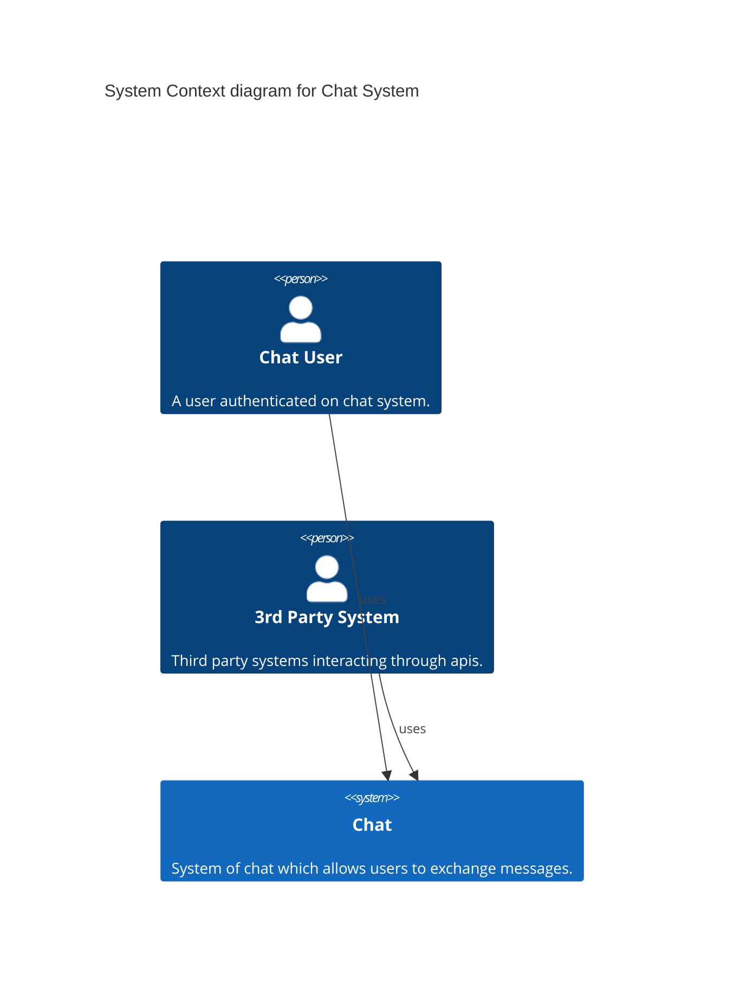
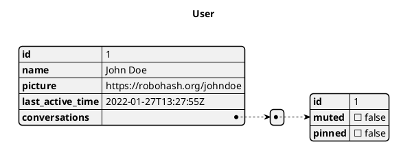
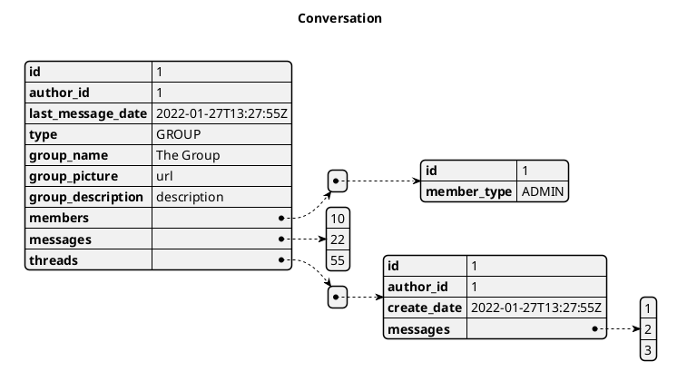
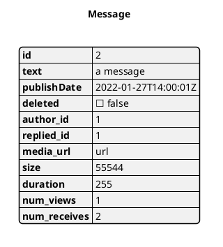
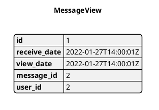
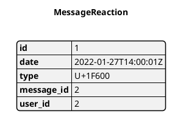

# Just Another Chat

## Visão Geral

A empresa ABC, provedora de serviços de email, percebeu que poderia aumentar o engajamento de seus usuário através da criação de um chat integrado ao seu ecosistema. Essa empresa já possui uma base com milhões de usuário, e utilizando o chat, ela poderia se consolidar ainda mais aumentando sua base, e consequentemente, ganhando mercado.

A ideia é que um chat seja disponibilizado junto ao email no seu sistema web, e que exista um aplicativo independente disponível para iOS e Android. Pessoas físicas ou jurídicas também poderão fazer uso do chat para notificações automáticas integradas à outros sistema. 

## Guias arquiteturais

### Requisitos funcionais

 - A transmissão de mensagens deve ser instantânea(real time);
 - A troca de mensagens deve ser de um para um(mensagem direta), ou um para muitos(grupo);
 - A mensagem deve ter 5 estados(não enviada, enviada, recebida, e lida). Para grupos, a mensagem deve mudar o próximo estado quando tal estado compreender todos os membros(ex: uma mensagem não lida se torna lida quando todos os membros tiverem lido);
 - Deve ser possível adicionar reações a uma mensagem. No caso de grupo, um contador deve registrar a quantidade;
 - As mensagens dos grupos devem ser agrupadas em forma de threads
 - Deve ser possível responder a uma mensagem; 
 - No caso de grupos, a mensagem de resposta será publicada apenas na mesma thread da mensagem respondida;
 - Deve ser possível mencionar usuários que fazem parte de um grupo;
 - Cada mensagem deve conter o horário da publicação;
 - Cada conversa deve conter a data da última mensagem;
 - Cada conversa deve conter a quantidade de mensagens não lidas;
 - Deve ser possível publicar mensagens de texto, áudio, vídeo, imagem e arquivo;
 - Cada grupo deve conter uma descrição e a quantidade de membros;
 - Na descrição do usuário, deve ser mostrado quando foi a última vez que esteve ativo e se está online;
 - Grupos devem possuir usuários com papel administrativo;
 - Administradores poderão moderar conteúdo e adicionar/remover membros;
 - Chat deve fornecer apis públicas;
 - Cada usuário deve conseguir fixar até 3 conversas;
 - As conversas devem ser ordenadas por data da última mensagem decrescente;
 - Novas mensagens devem gerar notificações;
 - Notificações de conversas podem ser mutadas;
 - Menções devem gerar notificações mesmo que a conversa esteja mutada;
 - Conversas ou threads não serão apagadas, apenas mensagens;

### Restrições
 - A autenticação deve ser efetuada utilizando serviço de autenticação já utilizado pelos outros serviços da empresa ABC;

### Atributos de qualidade
 - Escalabilidade
 - Disponibilidade
 - Desempenho
 - Segurança
 - Privacidade

### Cenários
 - Escalabilidade -> Aumento no throughput -> O sistema deve se manter responsivo após um aumento de 5 vezes a média de acessos em condições normais;
 - Desempenho -> Tempo de resposta de transação -> O tempo de resposta das transações deve ser de no máximo 500ms;
 - Disponibilidade -> uptimpe -> O sitema deve estar disponível por no mínimo 99% do tempo;
 - Desempenho -> Tempo de envio de notificações -> O sistema deverá notificar o usuário sobre uma nova mensagem em no máximo 2s a partir do momento da publicação;
 - Desempenho -> Tempo de envio de mensagem -> O usuário deverá receber a notificação em seu chat em no máximo 2s a partir do momento da publicação;
 - Desempenho -> Tempo de publicação de mensagem de texto -> A publicação de mensagens de texto deve acontecer em no máximo 500ms;
 - Desempenho -> Tempo de publicação de mensagem de mídia -> A publicação de mensagens de mídia deve acontecer em no máximo 2min;
 - Segurança -> Acesso não autenticado -> apis devem rejeitar requisições com status 401;
 - Privacidade -> Dados pessoais em requisições -> api's não devem expor dados pessoais dos usuários;

## Decisões de Design

### Class diagram


### System context diagram



### Container diagram

```plantuml
@startuml
!include https://raw.githubusercontent.com/plantuml-stdlib/C4-PlantUML/master/C4_Container.puml

Person(user, "Chat User", "A user authenticated on chat system.")
Person(3rd, "3rd Party System", "Third party systems interacting through apis.")

Container_Boundary(chat, "Chat System") {
     Container_Ext(mobile_app, "Mobile App", "iOS/Android", "Mobile app used by users to interact on chat")
     Container_Ext(web_app, "Web App", "Node,Javascript", "Web app used by users to interact on chat")   
     Container(api_gateway, "API Gateway", "Java, Docker container", "3rd party gateway service") 
     ContainerDb(file_storage, "File storage service", "File storage service", "Service to store uploaded files")

     Container_Boundary(chat_service, "Chat Service") {
         Container(backend_api, "Backend API", "Java, Docker container", "Provides chat functionality via api")
         ContainerDb(db, "Chat DB", "NOSQL Database", "Chat system main database")
     }

     Container_Boundary(notification, "Notification Service") {
         Container(notification_service, "Notification Service", "Java, Docker container/Serverless Function", "Service responsible for sending push notifications")
         ContainerDb(notification_db, "Notification DB", "NOSQL Database", "Database to support dealing with notifications")
     }
}

Container_Ext(auth, "Authentication Service", "Service", "Service responsible for authenticating users")
Container_Ext(fcm_apns, "FCM & APNS", "FCM & APNS", "Mobile platforms notification services")

Rel(user, mobile_app, "Uses")
Rel(user, web_app, "Uses")
Rel(3rd, api_gateway, "Uses")

Rel(mobile_app, file_storage, "Uploads to")
Rel(web_app, file_storage, "Uploads to")
Rel(backend_api, db, "Reads from and writes to")
Rel(api_gateway, backend_api, "Calls")
Rel(web_app, backend_api, "Calls")
Rel(mobile_app, backend_api, "Calls")
Rel_L(backend_api, file_storage, "Load uploaded files from")
Rel(notification_service, notification_db, "Reads from and writes to")
Rel(notification_service, fcm_apns, "Saves notifications to")

Rel_L(mobile_app, auth, "Authenticates on")
Rel_L(web_app, auth, "Authenticates on")
Rel_L(api_gateway, auth, "Authenticates on")
Rel_L(backend_api, auth, "Validades authentication")
Rel(backend_api, notification_service, "Uses")

@enduml
```

### Component diagram

```plantuml
@startuml
!include https://raw.githubusercontent.com/plantuml-stdlib/C4-PlantUML/master/C4_Component.puml

    Container_Ext(mobile_app, "Mobile App", "iOS/Android", "Mobile app used by users to interact on chat")
    Container_Ext(web_app, "Web App", "Node,Javascript", "Web app used by users to interact on chat")
    Container_Ext(api_gateway, "API Gateway", "Java, Docker", "Third party systems interacting through apis.")

    Container_Boundary(api, "Chat System API") {
        Component(dispatcher, "Request Dispatcher", "Spring Servlet Dispatcher", "Dispatch Request to Spring Controllers")
        Component(messagec, "Message Controller", "MVC Rest Controller", "Provides Message api endpoints")
        Component(conversationc, "Conversation Controller", "MVC Rest Controller", "Provides Conversation api endpoints")
        Component(userc, "User Controller", "MVC Rest Controller", "Provides User api endpoints")

        Component(chatservice, "Chat Service", "Service", "Service to handle chat business rules")
        Component(chatdao, "Chat DAO", "DAO", "Provides access to chat db")
        Component(storage, "Storage Service", "Service", "Provides mechanisms for using external file storage")
        Component(event, "Event Service", "Service", "Provides mechanisms for notifying changes in the system")
     
        ComponentQueue(eventqueue, "Event Queue", "Queue of application events")

        Rel(messagec, chatservice, "Uses")
        Rel(conversationc, chatservice, "Uses")
        Rel(userc, chatservice, "Uses")
        

        Rel(chatservice, chatdao, "Uses")
        Rel(chatservice, storage, "Uses")
        Rel(chatservice, event, "Uses")
    }

    Container_Boundary(intcomp, "Chat System Internal Components") {
        ContainerDb(db, "Chat DB", "NOSQL Database", "Chat system main database")
        ContainerDb(file_storage, "File storage service", "File storage service", "Service to store uploaded files")
        Container(notification_service, "Notification Service", "Java, Docker container/Serverless Function", "Service responsible for sending push notifications")
    }

    Rel(mobile_app, dispatcher, "SendS requests to", "JSON/HTTPS")
    Rel(web_app, dispatcher, "SendS requests to", "JSON/HTTPS")
    Rel(api_gateway, dispatcher, "SendS requests to", "JSON/HTTPS")

    Rel(dispatcher, messagec, "Dispatches requests to", "JSON/HTTPS")
    Rel(dispatcher, conversationc, "Dispatches requests to", "JSON/HTTPS")
    Rel(dispatcher, userc, "Dispatches requests to", "JSON/HTTPS")    

    Rel(chatdao, db, "Uses")
    Rel(event, eventqueue, "Send events to")
    Rel_Back(eventqueue, notification_service, "Consume events from")
    Rel(storage, file_storage, "Send/get files from/to")

@enduml
```

## Abordagens arquiteturais
 - Contadores materializados (desempenho)
 - Utilização de protocolo full-duplex (desempenho)
 - Banco de dados não relacional (escalabilidade)
 - Cluster de servidores acessados por load balancer de alta disponibilidade (disponibilidade)
 - Utilização de serviço de armazenamento para uploads de arquivos
 - Redução da qualidade de vídeos no app antes de enviar para o backend (desempenho);
 - Autenticação utilizando OAuth + JWT para usuários e API Key para integrações(developer api) (segurança)
 - Autorização utilizando Oauth e roles de usuário já mantidos pelo serviço de autenticação (segurança)
 - Utilização de índices para padrões de acesso de busca de membros (ex: envio de notificações)


## Riscos
 - Tamanho da mídia postada consumir consideravelmente pacote de dados da operadora de internet móvel do usuário;
 - Processamento local de vídeos comprometer desempenho ou bateria de smartphones com pouco recurso de hardware;
 - Time de desenvolvedores ter dificuldades em lidar com protocolo com o qual não possuem familiaridade;
 - Processamento de notificações de grupos que possuem muitos membros causar atraso no envio das notificações; 
 - Indisponibilidade do serviço de autenticação.

## Não-riscos
 - Usuários deixarem de utilizar o App;

## Pontos de sensibilidade
 - Quantidade de nós no cluster da aplicação; 
 - Quantidade de nós no cluster do banco;
 - Tamanho das máquinas do banco;

## Tradeoffs
 - O bit rate definido para a conversão local dos videos antes do envio para o backend;


### Padrões de acesso

 - (read) Listar conversas de um usuário(membro), com as que estiverem fixadas no topo (crítico);
 - (read) Listar mensagens de uma conversa (crítico);
 - (read) Listar usuários de um grupo, identificando quais são admins (baixo thp);
 - (read) Listar usuários para criar um grupo (baixo thp);
 - (read) Listar reações de uma mensagem (não crítico);
 - (read) Listar threads de um grupo (crítico);
 - (read) Listar mensagens de uma thread (crítico);
 - (read) Listar resposta de uma mensagem;
 - (write) Criar uma conversa/grupo; (crítico)
 - (write) Criar uma thread em um grupo; (crítico)
 - (write) Criar uma mensagem em uma conversa/thread; (crítico)
 - (write) Reagir a uma mensagem; (não crítico)
 - (write) Apagar uma mensagem (não crítico, baixo thp);
 - (write) Visualizar uma mensagem (não crítico, alto thp);
 - (write) Incluir membro a um grupo (não crítico, baixo thp);
 - (write) Remover membro de um grupo (crítico, baixo thp).


### Potenciais índices

 - conversation_member.user_id
 - conversation.id
 - message.conversation_id
 

### Data Storage











### APIs

TODO
*** em sessão de api
stoplight.io

### Degree of constraint

TODO

## Alternatives considered

SAAS (getstream, rocket chat, sendbird)

## Cross-cutting concerns
- Segurança
- Privacidade

## Authors
10/09/2020 - Criação. Autor: renato.ribeiro
