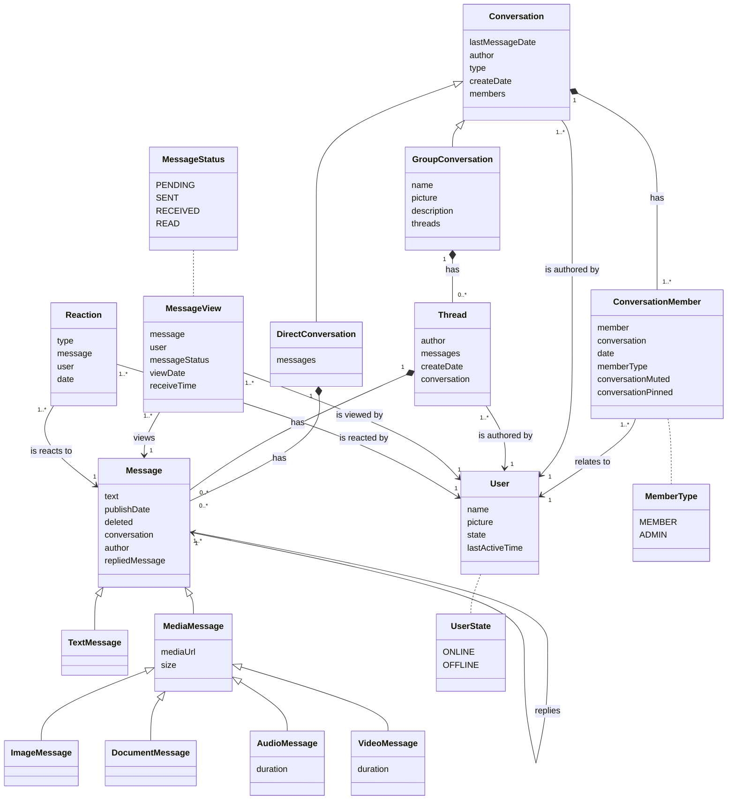
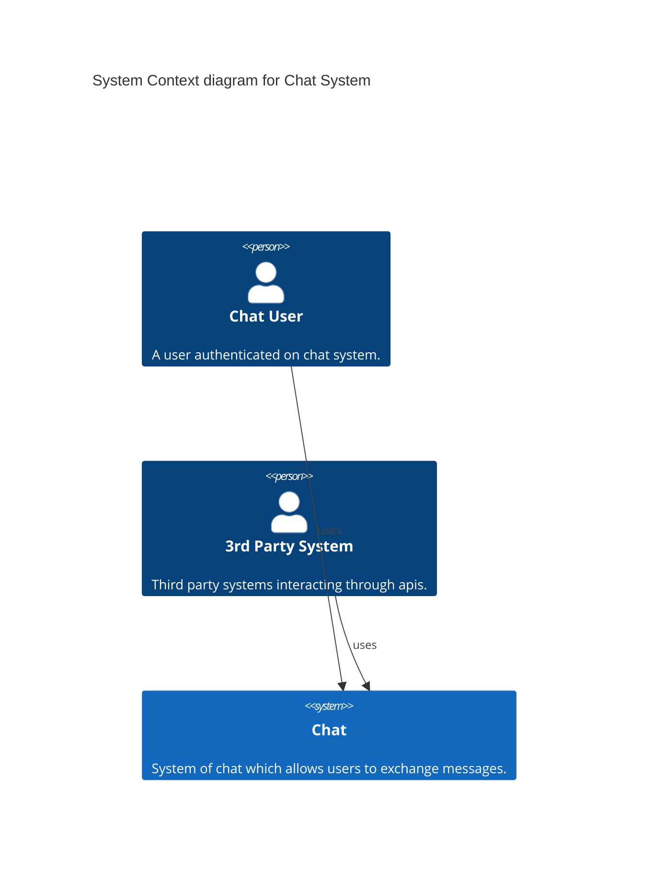

# Just Another Chat

## Contexto

O Chat é um projeto criado com a intenção de exercitar as habilidades de arquitetura de sistemas, desde a modelagem até o desenho da infraestrutura.

A ideia é que seja modelado um sistema de chat escalável que permita conversas em tempo real.

## Requisitos

 - A transmissão de mensagens deve ser instantânea(real time);
 - A troca de mensagens deve ser de um para um(mensagem direta), ou um para muitos(grupo);
 - A mensagem deve ter 5 estados(não enviada, enviada, recebida, e lida). Para grupos, a mensagem deve mudar o próximo estado quando tal estado compreender todos os membros(ex: uma mensagem não lida se torna lida quando todos os membros tiverem lido);
 - Deve ser possível adicionar reações a uma mensagem. No caso de grupo, um contador deve registrar a quantidade;
 - As mensagens dos grupos devem ser agrupadas em forma de threads
 - Deve ser possível responder a uma mensagem; 
 - No caso de grupos, a mensagem de resposta será publicada apenas na mesma thread da mensagem respondida;
 - Deve ser possível mencionar usuários que fazem parte de um grupo;
 - Cada mensagem deve conter o horário da publicação;
 - Cada conversa deve conter a data da última mensagem;
 - Cada conversa deve conter a quantidade de mensagens não lidas;
 - Deve ser possível publicar mensagens de texto, áudio, vídeo, imagem e arquivo;
 - Cada grupo deve conter uma descrição e a quantidade de membros;
 - Na descrição do usuário, deve ser mostrado quando foi a última vez que esteve ativo e se está online;
 - Grupos devem possuir usuários com papel administrativo;
 - Administradores poderão moderar conteúdo e adicionar/remover membros;
 - Chat deve fornecer apis públicas;
 - Cada usuário deve conseguir fixar até 3 conversas;
 - As conversas devem ser ordenadas por data da última mensagem decrescente;
 - Novas mensagens devem gerar notificações;
 - Notificações de conversas podem ser mutadas;
 - Menções devem gerar notificações mesmo que a conversa esteja mutada;

### Class diagram

### System-context-diagram

### Container-diagram

### Component-diagram

