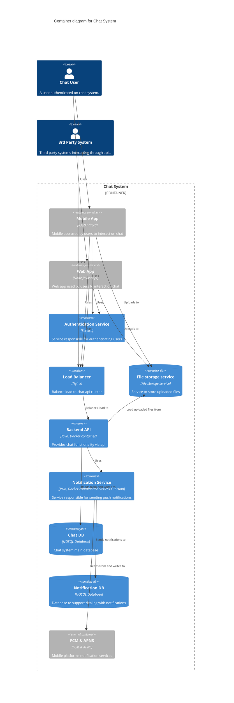
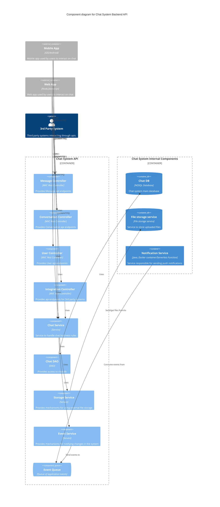

# Just Another Chat

## Visão Geral

A empresa ABC, provedora de serviços de email, percebeu que poderia aumentar o engajamento de seus usuário através da criação de um chat integrado ao seu ecosistema. Essa empresa já possui uma base com milhões de usuário, e utilizando o chat, ela poderia se consolidar ainda mais aumentando sua base, e consequentemente, ganhando mercado.

A ideia é que um chat seja disponibilizado junto ao email no seu sistema web, e que exista um aplicativo independente disponível para iOS e Android. Pessoas físicas ou jurídicas também poderão fazer uso do chat para notificações automáticas integradas à outros sistema. 

## Guias arquiteturais

### Requisitos funcionais

 - A transmissão de mensagens deve ser instantânea(real time);
 - A troca de mensagens deve ser de um para um(mensagem direta), ou um para muitos(grupo);
 - A mensagem deve ter 5 estados(não enviada, enviada, recebida, e lida). Para grupos, a mensagem deve mudar o próximo estado quando tal estado compreender todos os membros(ex: uma mensagem não lida se torna lida quando todos os membros tiverem lido);
 - Deve ser possível adicionar reações a uma mensagem. No caso de grupo, um contador deve registrar a quantidade;
 - As mensagens dos grupos devem ser agrupadas em forma de threads
 - Deve ser possível responder a uma mensagem; 
 - No caso de grupos, a mensagem de resposta será publicada apenas na mesma thread da mensagem respondida;
 - Deve ser possível mencionar usuários que fazem parte de um grupo;
 - Cada mensagem deve conter o horário da publicação;
 - Cada conversa deve conter a data da última mensagem;
 - Cada conversa deve conter a quantidade de mensagens não lidas;
 - Deve ser possível publicar mensagens de texto, áudio, vídeo, imagem e arquivo;
 - Cada grupo deve conter uma descrição e a quantidade de membros;
 - Na descrição do usuário, deve ser mostrado quando foi a última vez que esteve ativo e se está online;
 - Grupos devem possuir usuários com papel administrativo;
 - Administradores poderão moderar conteúdo e adicionar/remover membros;
 - Chat deve fornecer apis públicas;
 - Cada usuário deve conseguir fixar até 3 conversas;
 - As conversas devem ser ordenadas por data da última mensagem decrescente;
 - Novas mensagens devem gerar notificações;
 - Notificações de conversas podem ser mutadas;
 - Menções devem gerar notificações mesmo que a conversa esteja mutada;

### Restrições
 - A autenticação deve ser efetuada utilizando serviço de autenticação já utilizado pelos outros serviços da empresa ABC;

### Atributos de qualidade
 - Escalabilidade
 - Disponibilidade
 - Desempenho
 - Segurança
 - Privacidade

### Cenários
 - Escalabilidade -> Aumento no throughput -> O sistema deve se manter responsivo após um aumento de 5 vezes a média de acessos em condições normais;
 - Desempenho -> Tempo de resposta de transação -> O tempo de resposta das transações deve ser de no máximo 500ms;
 - Disponibilidade -> uptimpe -> O sitema deve estar disponível por no mínimo 99% do tempo;
 - Desempenho -> Tempo de envio de notificações -> O sistema deverá notificar o usuário sobre uma nova mensagem em no máximo 2s a partir do momento da publicação;
 - Desempenho -> Tempo de envio de mensagem -> O usuário deverá receber a notificação em seu chat em no máximo 2s a partir do momento da publicação;
 - Desempenho -> Tempo de publicação de mensagem de texto -> A publicação de mensagens de texto deve acontecer em no máximo 500ms;
 - Desempenho -> Tempo de publicação de mensagem de mídia -> A publicação de mensagens de mídia deve acontecer em no máximo 2min;
 - Segurança -> Acesso não autenticado -> apis devem rejeitar requisições com status 401;
 - Privacidade -> ???

## Decisões de Design

### Class diagram

### System context diagram

### Container diagram

### Component diagram

## Abordagens arquiteturais
 - Contadores materializados (desempenho)
 - Utilização de protocolo full-duplex (desempenho)
 - Banco de dados não relacional (escalabilidade)
 - Cluster de servidores acessados por load balancer de alta disponibilidade (disponibilidade)
 - Utilização de serviço de armazenamento para uploads de arquivos
 - Redução da qualidade de vídeos enviados pelo app (desempenho);

## Riscos
 - Tamanho da mídia postada consumir consideravelmente pacote de dados da operadora de internet móvel do usuário;
 - Processamento local de vídeos comprometer desempenho ou bateria de smartphones com pouco recurso de hardware;
 - Time de desenvolvedores ter dificuldades em lidar com protocolo com o qual não possuem familiaridade;
 - Processamento de notificações de grupos que possuem muitos membros causar atraso no envio das notificações;

## Não-riscos
 - Usuários deixarem de utilizar o App;

## Pontos de sensibilidade
 - Quantidade de nós no cluster;

## Tradeoffs
 - O bit rate definido para os videos serem convertidos antes de serem enviados;

### APIs

TODO

### Data Storage

TODO

### Degree of constraint

TODO

## Alternatives considered

TODO

## Cross-cutting concerns
Segurança
Privacidade

## Authors
10/09/2020 - Criação. Autor: renato.ribeiro
